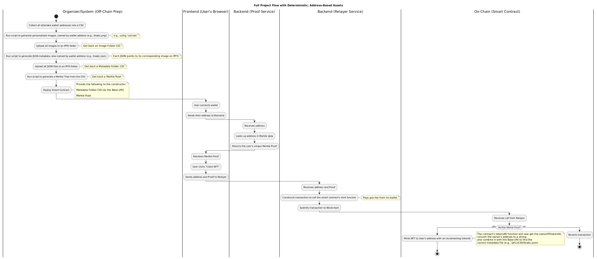

# Event Certificate NFT System

A production-ready, **soulbound NFT certification system** for live events on **Base L2**.  
Attendees claim NFTs as digital certificates by proving their inclusion in an allowlist via **Merkle proofs**.

The system consists of three main components:

1. **Smart Contract** (Solidity, Foundry) – EventCertificate ERC721 contract
2. **Backend Services** (Express.js) – Proof & Relayer APIs
3. **Frontend DApp** (React) – User-facing claim portal

## Event Certificate NFT Activity Diagram

